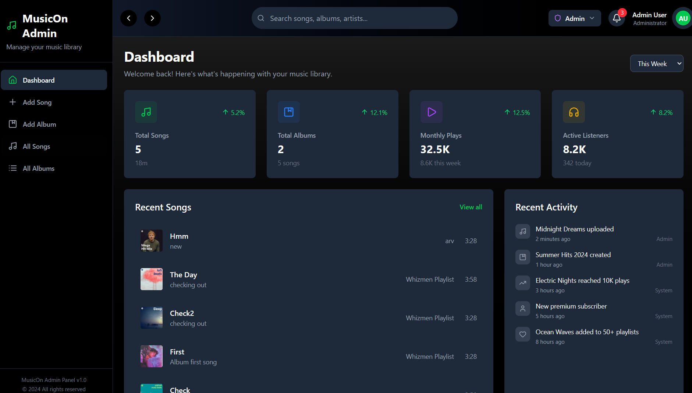
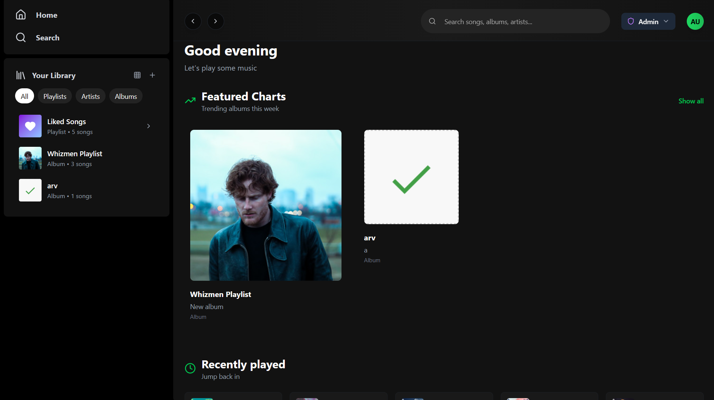

# 🎵 MusicOn - Full Stack Spotify Clone

A full-stack music streaming application built with **React (Vite)** and **Node.js + Express**, featuring user and admin dashboards, playlist management, and music playback.

---

## 🚀 Live Demo
- **Frontend (Vercel)**: [MusicOn Frontend](https://music-on-wisemen.vercel.app/admin)  
- **Backend (Render)**: [MusicOn Backend](https://musicon-fullstack.onrender.com)  

---

## ✨ Features
### 👤 User
- Browse and play songs & albums  
- Create and view playlists  
- Recently played section  
- Modern Spotify-inspired UI  

### 🛠️ Admin
- Add albums & songs  
- View dashboard stats (songs, albums, plays, listeners)  
- Recent activity logs  

---

## 🖼️ Screenshots
### Admin Dashboard
![Admin Dashboard]

### User Dashboard
![User Dashboard]

---

## 🛠️ Tech Stack
- **Frontend**: React (Vite), Context API, Axios  
- **Backend**: Node.js, Express, MongoDB, Cloudinary  
- **Deployment**: Vercel (frontend), Render (backend)  

---

